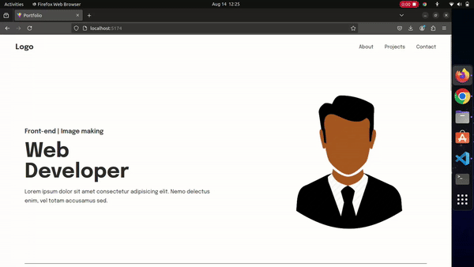

# My Portfolio

This is my personal portfolio website built using Vite, React, SASS and TypeScript. It showcases my projects, skills, and experience as a front-end developer.

## Table of Contents

- [Overview](#overview)
- [Features](#features)
- [Installation](#installation)
- [Usage](#usage)
- [Technologies Used](#technologies-used)
- [Design Credit](#design-credit)
- [Contributing](#contributing)
- [License](#license)
- [Contact](#contact)

## Overview

This portfolio is designed to provide a clear representation of my work and skills. It includes sections such as an introduction, project showcases, and contact information. The website is fully responsive and built with a modern tech stack.



## Features

- **Responsive Design**: Works on desktops, tablets, and mobile devices.
- **Smooth Navigation**: Implemented with React Router and smooth scroll.
- **Animated Transitions**: Using Framer Motion for subtle animations.
- **Project Showcases**: Detailed descriptions and links to live projects and repositories.
- **Contact Form**: Allows visitors to get in touch with me directly.

## Installation

To run this project locally, follow these steps:

1. Clone the repository:

   ```bash
   git clone https://github.com/rowleks/portfolio-site.git
   ```
2. Navigate to the project:

   ```bash
   cd portfolio-site
   ```
3. Install dependencies:

   ```bash
   npm install
   ```
4. Start the developer server:

   ```bash
   npm run dev
   ```
5. Open your browser and visit `http://localhost:5173`

## Usage

Once the project is set up, you can explore the portfolio by navigating through different sections. You can view my projects, read about my skills, and contact me via the form provided.

## Technologies Used

- **Vite**: For blazing-fast development and build processes.
- **React**: For building the user interface.
- **TypeScript**: For type safety and better developer experience.
- **React Router**: For seamless navigation between pages.
- **Framer Motion**: For smooth animations and transitions.
- **Sass**: For advanced CSS styling with variables, nested rules, and more.
- **EmailJS**: For handling contact form submissions directly through email.
- **React Toastify**: For providing elegant and customizable notifications.
- **React Anchor Link Smooth Scroll**: For smooth scrolling between sections of the page.

## Design Credit

The design for this portfolio project was inspired by a [Figma community project](https://www.figma.com/design/Oa2LTmxlix6tsvUs09P4mu/Portfolio-website-template---Edit-your-portfolio-and-get-your-website-live-(Community)?node-id=0-1&t=EPQmbGZksz155RZq-0). Special thanks to the original designer for providing this template.

## Contributing

If you would like to contribute to this project, feel free to fork the repository and submit a pull request. Any contributions that improve the codebase or add new features are welcome!

## License

This project is licensed under the MIT License.

## Contact

You can reach out to me through the following channels:

- **Email**: [momohrowland@gmail.com](mailto:momohrowland@gmail.com)
- **LinkedIn**: [Rowland Momoh](https://www.linkedin.com/in/rowland-momoh-b32a7a22a/)

Feel free to connect with me if you have any questions, feedback, or opportunities you'd like to discuss. I look forward to hearing from you!
